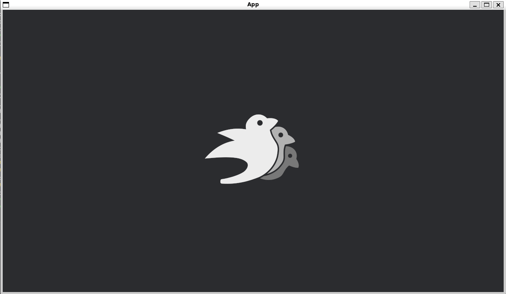

# Sprite

[出典先](https://bevyengine.org/examples/2d-rendering/sprite/)

## サンプル

## Bevy 特有の機能を解説

### `App::new()`

- 新しい Bevy アプリケーションを作成

### `.add_plugins(DefaultPlugins)`

- Bevy の **デフォルトプラグイン (DefaultPlugins)** を追加
- DefaultPlugins` には **ウィンドウ管理、レンダリング、アセット管理** などが含まれている。

### `.add_systems(Startup, setup)`

- `Startup` フェーズで `setup` システムを実行。
- `setup` はアプリ起動時に 1 回だけ実行される。

### カメラの追加 (commands.spawn(Camera2d))

- `Camera2d` は 2D 描画用のカメラ
- これがないとスプライトが表示されない

### スプライトの追加

- `asset_server.load("branding/bevy_bird_dark.png")` で画像をロード。
- `commands.spawn(Sprite::from_image(...))` でスプライトを作成し、エンティティとしてスポーン。
