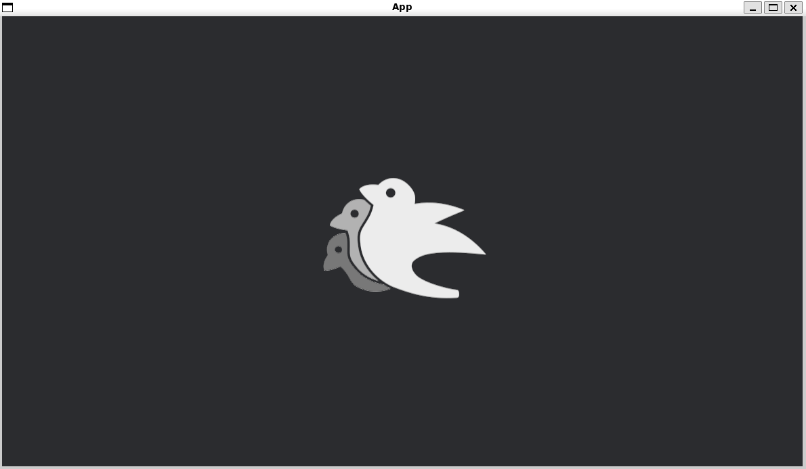

# Sprite Flipping

[出典先](https://bevyengine.org/examples/2d-rendering/sprite-flipping/)

## サンプル



## Bevy 特有の機能

```rust
commands.spawn(Sprite {
    image: asset_server.load("branding/bevy_bird_dark.png"),
    // 左にフリップ
    flip_x: true,
    // false にすると y軸にはフリップしない
    flip_y: false,
    ..Default::default()
});
```
