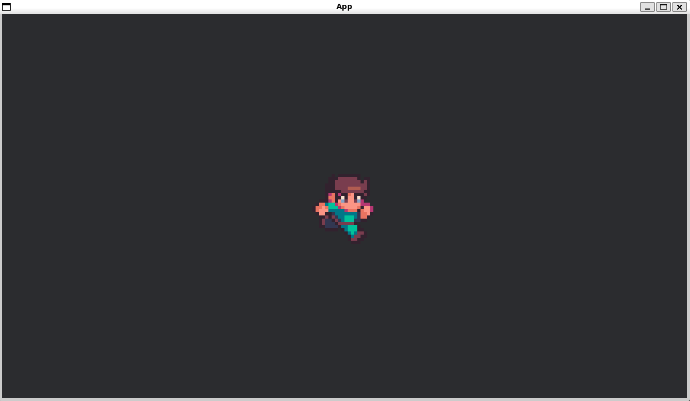

# Sprite Sheet

[出典先](https://bevyengine.org/examples/2d-rendering/sprite-sheet/)

## サンプル



## Bevy 特有の機能

### `App::new()`

```rust
App::new()
    .add_plugins(DefaultPlugins.set(ImagePlugin::default_nearest()))
    .add_systems(Startup, setup)
    .add_systems(Update, animate_sprite)
    .run();
```

- `add_plugins(DefaultPlugins)`
  - **Bevy の標準プラグインセット** を追加する
  - これにより、**ウィンドウ管理、アセット管理、レンダリング** などの機能が使えるようになる。
- `set(ImagePlugin::default_nearest())`
  - `ImagePlugin` の設定を「二アレスト補間 (Nearest Neighbor)」に変更する
  - これにより、スプライトの拡大時に **ぼやけるのを防ぐ**。
  - **ピクセルアート風のゲーム** では特に重要。
- `add_systems(Startup, setup)`
  - `Startup` ステージで `setup` システムを実行。
  - `Startup` ステージは、**アプリを起動時に 1 回だけ実行** される
- `add_systems(Update, animate_sprite)`
  - `Update` ステージで `animate_sprite` システムを毎フレーム実行。
  - `Update` は **ゲームループのメイン処理** にあたる。

### `Commands`

```rust
fn setup(mut commands: Commands, asset_server: Res<AssetServer>, mut texture_atlas_layouts: ResMut<Assets<TextureAtlasLayout>>) {
    commands.spawn(Camera2d);
}
```

- `Commands` は **エンティティの生成や変更を行うための API**。
- `.spawn(Camera2d)`
  - **2D カメラを追加** する \*(`Camera2d` は Bevy0.12 から導入)。
  - これを追加しないと、スプライトが描画されない。

### `Component`

```rust
#[derive(Component)]
struct AnimationIndices {
    first: usize,
    last: usize,
}
```

- `#[derive(Component)]` をつけることで ** Bevy の ECS (Entity-Component-System) におけるコンポーネント** になる。
- `AnimationIndices` は **スプライトアニメーションの最初と最後のフレームを保持するコンポーネント**。

### `Query`

```rust
fn animate_sprite(
    time: Res<Time>,
    mut query: Query<(&AnimationIndices, &mut AnimationTimer, &mut Sprite)>,
) {
    for (indices, mut timer, mut sprite) in &mut query {
        timer.tick(time.delta());

        if timer.just_finished() {
            if let Some(atlas) = &mut sprite.texture_atlas {
                atlas.index = if atlas.index == indices.last {
                    indices.first
                } else {
                    atlas.index + 1
                }
            }
        }
    }
}
```

- `Query` は **エンティティの生成・取得に使用する仕組み**。
- `Query<(&AnimationIndices, &mut AnimationTimer, &mut Sprite)>`
  - `AnimationIndices`、`AnimationTimer`、`Sprite` **の 3 つのコンポーネントを持つエンティティを検索**。
- `for (indices, mut timer, mut sprite) in &mut query { ... }`
  - `query` から**該当する全エンティティを取得し、ループで処理** する。

### `Timer`

```rust
#[derive(Component, Deref, DerefMut)]
struct AnimationTimer(Timer);
```

- Bevy では **一定時間ごとに処理を実行するための** `Timer` **コンポーネント** がある。
- `Timer::from_seconds(0.1, TimerMode::Repeating)`
  - **0.1 秒ごとにアニメーションを更新**。
  - `TimerMode::Repeating` にすることで、**繰り返し処理** を可能にする
- `timer.tick(time.delta())`
  - タイマーを進める。
- `if timer.just_finished() { ... }`
  - **タイマーが完了白田アニメーションのフレームを更新**。

### `TextureAtlas`

```rust
Sprite::from_atlas_image(
    texture,
    TextureAtlas {
        layout: texture_atlas_layout,
        index: animation_indices.first,
    },
)
```

- `TextureAtlas` は **スプライトシート (複数のスプライトが 1 つの画像にまとめられたもの) の監理に使う**。
- `TextureAtlasLayout::from_grid(UVec2::splat(24), 7, 1, None, None);`
  - **スプライトシートを 24x24 のマス目に分割**。
  - 横に 7 フレーム分、縦に 1 フレーム分のスプライトがある。

### `Res` & `ResMut`

```rust
fn setup(
    mut commands: Commands,
    asset_server: Res<AssetServer>,
    mut texture_atlas_layouts: ResMut<Assets<TextureAtlasLayout>>,
)
```

- `Res<T>` **(リソースの読み取り専用)**
  - `Res<Time>` → **ゲームの経過時間などを管理するリソース**。
  - `Res<AssetServer>` → **アセット (画像や音楽) のロードを管理するリソース**。
- `ResMut<T>` **(リソースの変更可能な参照)**
  - `ResMut<Assets<TextureAtlasLayout>>` → **スプライトシートのレイアウトを追加・変更できる**。
