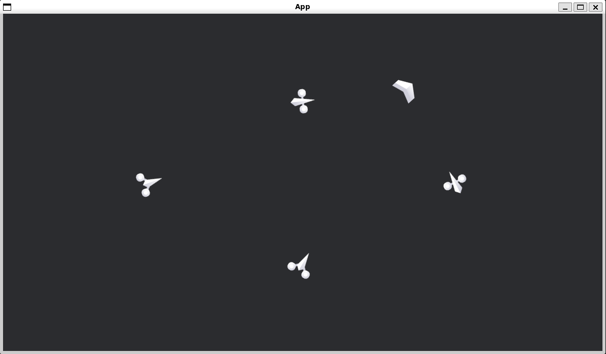

# 2D Rotation

[出典先](https://bevyengine.org/examples/2d-rendering/rotation/)

## サンプル

### アプリケーション起動時


### プレイヤーが移動した座標に向けて敵宇宙船が対象の座標に向く



## Bevy 特有の機能

### `Transform` と `Quat` を使った座標・回転の制御

Bevy では `Transform` コンポーネントを使用して、エンティティの **位置・回転・スケール** を管理します。

```rust
transform.rotate_z(rotation_factor * ship.rotation_speed * time.delta_secs());
```

これは **Z 軸周りの回転** を適用する処理です。

また、敵がプレイヤーの方向を向く処理では `Quat::from_rotation_arc` を使用しています：

```rust
let rotate_to_player = Quat::from_rotation_arc(Vec3::Y, to_player.extend(0.));
enemy_transform.rotation = rotate_to_player;
```

これは **ある方向** (`Vec3::Y`) **を指定方向** (`to_player`) **に向ける回転** を作成する処理です。
