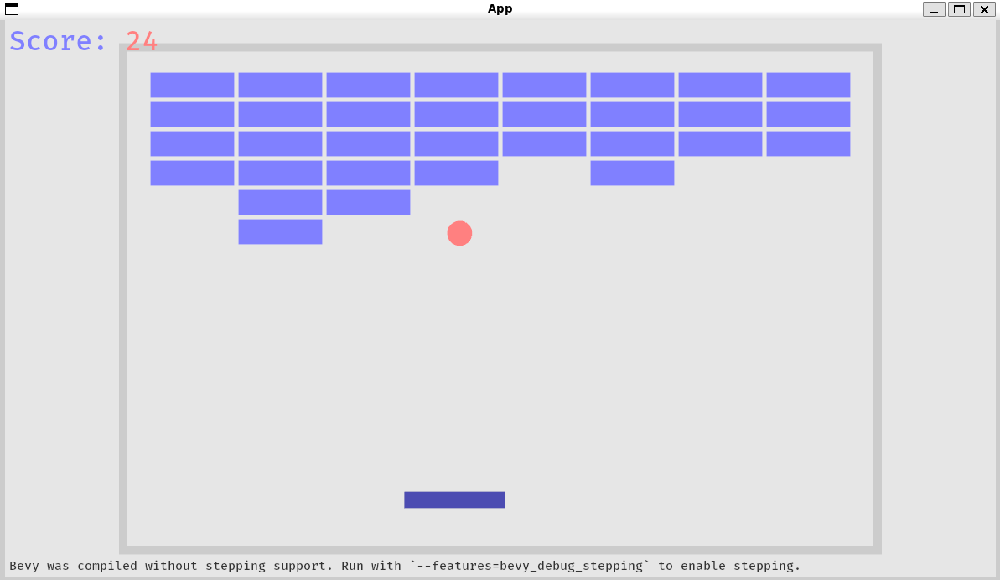

# ブロック崩し

[出典先](https://github.com/bevyengine/bevy/blob/latest/examples/games/breakout.rs)

## サンプル



## main.rs

## stepping.rs

### Bevy のスケジュール順序

```rust
use bevy::app::MainScheduleOrder;
```

- Bevy ではシステムの実行順序を **スケジュール (`Schedule`)** で管理します。
- `MainScheduleOrder` は、アプリケーションのメインスケジュール (`Startup`, `Update`, `PostUpdate`, など)の順序を制御するためのリソースです。
- `order.insert_after(Update, DebugSchedule);` のように使うことで、指定したスケジュール (`DebugSchedule`) を `Update` の後に挿入できます。

### スケジュール関連の機能

```rust
use bevy::ecs::schedule::*;
```

- `Schedule` は Bevy の **ECS (Entity-Component-System)** のシステム実行順序を管理するための仕組み です。
- Bevy では `Startup` (**初回のみ実行**), `Update` (**毎フレーム実行**), `PostUpdate` (**更新後に実行**) などのデフォルトスケジュールがあります。
- `ScheduleLabel` はカスタムスケジュールを作るためのラベルです。

```rust
/// 独立した [`Schedule`] を定義し、デバッグ用のステッピング処理を行う。
/// スケジュールを独立させることで、他のスケジュールを調査できるようにする。
#[derive(Debug, Hash, PartialEq, Eq, Clone, ScheduleLabel)]
struct DebugSchedule;
```

- `DebugSchedule` という独自のスケジュールを作成。
- `derive(ScheduleLabel)` を使うことで Bevy のスケジュールとして利用可能になります。

```rust
app.init_schedule(DebugSchedule);
```

- `DebugSchedule` を Bevy のスケジュールに追加

### `Plugin` の仕組み

```rust
impl Plugin for SteppingPlugin {
    fn build(&self, app: &mut App) {
        app.add_systems(Startup, build_stepping_hint);

```

- Bevy では `Plugin` を使って機能をモジュール化できます。
- `build()` 内で `app.add_systems()` を使うことで、特定のタイミング (`Startup`, `Update` など) にシステムを追加できます。

### `Resource`

```rust
#[derive(Resource, Debug)]
struct State {
    systems: Vec<(InternedScheduleLabel, NodeId, usize)>,
    ui_top: Val,
    ui_left: Val,
}
```

- `#[derive(Resource)]` をつけると Bevy の **リソース (ECS のグローバルデータ) として管理** できます。
- `systems: Vec<(InternedScheduleLabel, NodeId, usize)>`
  → デバッグ対象のスケジュール・システム情報を格納。
- `ui_top: Val, ui_left: Val`
  → UI の表示位置を管理

```rust
app.insert_resource(stepping);
```

- `Stepping` というリソースを Bevy に登録し、どのシステムからもアクセスできるようにする。

### `System`

```rust
fn handle_input(keyboard_input: Res<ButtonInput<KeyCode>>, mut stepping: ResMut<Stepping>) {
```

- fn で定義された関数が **ECS のシステム** になります。
- `Res<ButtonInput<KeyCode>>`
  → キーボード入力を監視する `Resource` (`Res` は Bevy の `Resource` をシステムに渡すための型)。
- `ResMut<Stepping>`
  → `Stepping` リソースを **可変参照 (ResMut) として取得** し、処理を行う。

### UI コンポーネント

```rust
commands.spawn((
    Text::new(hint_text),
    TextFont {
        font_size: 15.0,
        ..default()
    },
    TextColor(FONT_COLOR),
    Node {
        position_type: PositionType::Absolute,
        bottom: Val::Px(5.0),
        left: Val::Px(5.0),
        ..default()
    },
));
```

- `commands.spawn(())` は新しいエンティティを作成する。
- `Text::new(hint_text)` で UI のテキスト要素を作成。
- `Node { position_type: PositionType::Absolute, bottom: Val::Px(5.0), left: Val::Px(5.0) }`
  → UI の配置 (`Absolute` で画面の特定位置に固定)。
- `TextColor(FONT_COLOR)` でフォントの色を設定。

## Bevy の主要な要素と関係

### (1) スケジュール (`Schedule`)

Bevy では、すべてのゲームロジックは **スケジュール** によって管理されます。
スケジュールには、`Startup` や `Update` などの **ラベル** があり、それぞれのスケジュール内にシステムが登録されます。

このコードでは、**デバッグ用の独立したスケジュール** (`DebugSchedule`) を作成し、Bevy の `Update` スケジュールの後に実行されるように設定しています。

```rust
app.init_schedule(DebugSchedule);
let mut order = app.world_mut().resource_mut::<MainScheduleOrder>();
order.insert_after(Update, DebugSchedule);
```

- `app.init_schedule(DebugSchedule);`
  → `DebugSchedule` を新しいスケジュールとして追加。
- `order.insert_after(Update, DebugSchedule);`
  → `DebugSchedule` を `Update` の後に実行するように設定。

こうすることで、**通常のゲームロジックとは独立したスケジュール** を用意し、ステッピングのデバッグがしやすくなっています。

#### システム (`System`)

Bevy では **システム** は関数として定義され、データ駆動型で実行されます。
このプラグインでは、ステッピングを制御するための複数のシステムを `DebugSchedule` に登録しています。

```rust
.add_systems(
    DebugSchedule,
    (
        build_ui.run_if(not(initialized)),
        handle_input,
        update_ui.run_if(initialized),
    )
        .chain(),
);
```

- `build_ui.run_if(not(initialized))`
  → UI をまだ構築していない場合のみ実行。
- `handle_input`
  → ユーザーの入力を処理 (`Space` や `S` キーでステップを進める)。
- `update_ui.run_if(initialized)`
  → UI が初期化された後に更新。

`chain()` を使うことで **システムの実行順序を制御** しており、`build_ui → handle_input → update_ui` の順で動作します。

### (3) `cfg!(feature = "...")` 出のコンパイル時設定

このプラグインは **デバッグ時のみ有効化** できるようになっています。

```rust
if cfg!(not(feature = "bevy_debug_stepping")) {
    return;
}
```

→ `bevy_debug_stepping` の feature が有効でない場合、プラグインのデバッグ機能を無効化します。

そのため、**Cargo.toml で feature を有効化して実行する必要がある** という特徴があります。

```rust
cargo run --features "bevy_debug_stepping"
```

これをしないと、ステッピング UI は表示されません。

## ステッピング (Stepping) の仕組み

個のプラグインの主な目的は **システムの実行を逐次制御すること** です。

### (1) ステッピングの有効/無効切り替え

キーボード入力 (`KeyCode::Backquote`) に応じて、ステッピングを有効化・無効化します。

```rust
if keyboard_input.just_pressed(KeyCode::Backquote) {
    if stepping.is_enabled() {
        stepping.disable();
        debug!("disabled stepping");
    } else {
        stepping.enable();
        debug!("enabled stepping");
    }
}
```

- `Backquote` (```) を押すと ステッピングモードの ON/OFF を切り替える。

### (2) ステップ実行

```rust
if keyboard_input.just_pressed(KeyCode::Space) {
    debug!("continue");
    stepping.continue_frame();
} else if keyboard_input.just_pressed(KeyCode::KeyS) {
    debug!("stepping frame");
    stepping.step_frame();
}
```

- `Space` キー: 次のフレームへ進む (`continue_frame()`)
- `S` キー: 1 つのシステムだけ実行する (`step_frame()`)

### (3) UI の更新

`update_ui` システムで ステッピングのカーソル位置 を UI に反映します。

```rust
let mark = if &cursor_schedule == schedule && *system == cursor_system {
    "-> "
} else {
    "   "
};
*writer.text(ui, *text_index) = mark.to_string();
```

- 現在選択中のシステムに `"->"` を表示し、それ以外は `" "` にする。

これにより、**どのシステムが実行されるか視覚的に確認** できます。

## Bevy の UI システム

このプラグインは UI を使って情報を表示する ため、Bevy の `bevy_ui` 機能も活用しています。

### (1) UI の生成

```rust
commands
    .spawn((
        Text::default(),
        SteppingUi,
        Node {
            position_type: PositionType::Absolute,
            top: state.ui_top,
            left: state.ui_left,
            padding: UiRect::all(Val::Px(10.0)),
            ..default()
        },
        BackgroundColor(Color::srgba(1.0, 1.0, 1.0, 0.33)),
        Visibility::Hidden,
    ))
    .with_children(|p| {
        for span in text_spans {
            p.spawn(span);
        }
    });
```

- `Text` コンポーネントを使い、ステッピング UI を表示する。
- `Visibility::Hidden` に設定し、最初は非表示。
- `Node` で UI の位置やスタイルを設定。

### (2) UI の表示・非表示

```rust
match (vis, stepping.is_enabled()) {
    (Visibility::Hidden, true) => {
        commands.entity(ui).insert(Visibility::Inherited);
    }
    (_, false) => {
        commands.entity(ui).insert(Visibility::Hidden);
    }
}
```

→ **ステッピングが有効になったら UI を表示、無効なら非表示にする。**
